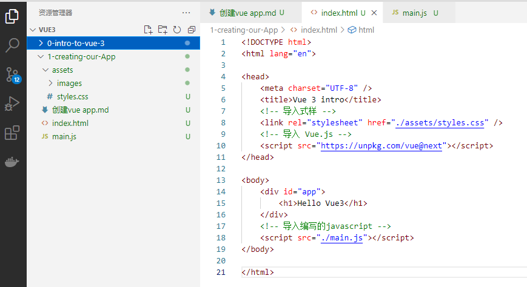
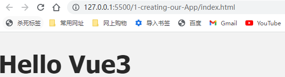
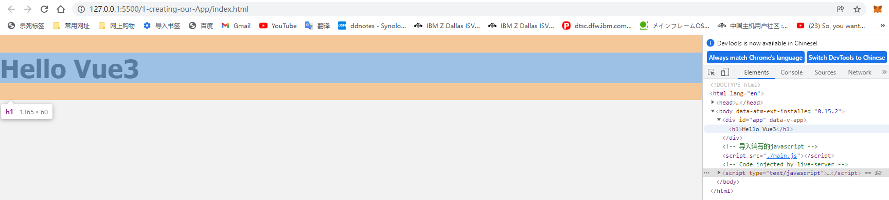

## 0. Vue 3 简介

欢迎来到 Vue 3 入门课程。我们将探索 Vue 3这项技术，并为新技能打下坚实的基础，这样我们就可以在此基础上，朝着 Vue 的掌握方向前进。本课程是您前进的第一步，我们可以使用[codepen.io](https://codepen.io/pen/tour/welcome/start)这个平台来在线测试我们的代码。或者使用vs code和git进行编写和管理代码。

在本课程中，我们将学习 Vue.js的基础知识，并构建一个应用程序来将这些概念付诸实践。Vue (读音 /vjuː/，类似于 **view**) 是一套用于构建用户界面的**前端框架**，旨在更好地组织与简化WEB开发，它能方便地获取数据的更新，并通过组件的方法实现视图和模型的交互。

接下来您将看到我使用 VS code这个代码编辑器用于Vue开发，但是如果你已经有了你选择的代码编辑器，你可以坚持使用那个。如果你也想和我一样，你将需要[立即下载它](https://code.visualstudio.com/download)，并安装一个扩展[es6-string-html。](https://marketplace.visualstudio.com/items?itemName=Tobermory.es6-string-html)您将了解为什么此扩展在后面的课程中很有用。

-----------

## 1. 创建 Vue 应用程序

你准备好创建一个 Vue 应用了吗？要开始学习本课，您可以查看[存储库](https://github.com/Code-Pop/Intro-to-Vue-3/tree/L2-start)分支上的起始代码，也可以转到[CodePen](https://codepen.io/VueMastery/project/editor/XvJmbL)开始使用。

------

### 1.1 导入 Vue.js 库

首先我们打开vs code建立一个`index.html`，然后在`index.html`中，我们先导入样式。

```html
<head>
    <meta charset="UTF-8" />
    <title>Vue 3 intro</title>
    <!-- 导入式样 -->
    <link rel="stylesheet" href="./assets/styles.css" />
</head>
```

在此之下，我们将导入 Vue.js 库。我们在[Installation | Vue.js (vuejs.org)](https://v3.vuejs.org/guide/installation.html#vue-devtools)中可以看到，通过 CDN 链接导入 Vue 库是开始使用 Vue 的最简单方法。

```html
<script src="https://unpkg.com/vue@next"></script>
```

所以我们把它加到html里

```html
<head>
    <meta charset="UTF-8" />
    <title>Vue 3 intro</title>
    <!-- 导入式样 -->
    <link rel="stylesheet" href="./assets/styles.css" />
    <!-- 导入Vue库 -->
    <script src="https://unpkg.com/vue@next"></script>
</head>
```

在文件的底部，我们正在导入**我们的main.js**文件，

```html
<body>
    <div id="app">
        <h1>Hello Vue3</h1>
    </div>
    <!-- 导入编写的javascript -->
    <script src="./main.js"></script>
</body>
```

文件层级解构如下




------

### 1.2 在main.js中创建 Vue 应用程序

要在 HTML 中显示我们的数据，我们首先必须创建一个 Vue 应用。在我们的`main.js`文件中，我们将使用以下命令创建应用程序：

📄**mian.js**

```javascript
const app = Vue.createApp({})
```

作为参数，我们将传入一个对象并添加一个数据属性。这将是一个返回另一个对象的函数，我们将要添加一个名字叫`hello`的变量，把要添加的数据项都写到data这个函数里，并`return`出来。

📄**main.js**

```javascript
const app = Vue.createApp({
    data() {
        return {
            hello: 'Socks'
        }
    }
})
```

现在，我们只需要确保将 Vue 应用导入到`index.html`文件中即可。

📄**index.html**

```html
<body>
    <div id="app">
        <h1>Hello Vue3</h1>
    </div>
    <!-- 导入编写的javascript -->
    <script src="./main.js"></script>
</body>
```

------

### 1.3 安装我们的应用程序

现在我们已经创建了应用程序，我们需要将刚刚创建的应用程序装载到我们的 DOM 中。我们将在**main.js**中执行此操作。

📄**main.js**

```javascript
const app = Vue.createApp({
    data() {
        return {
            hello: 'Hello Vue3'
        }
    }
});
<!-- Mount App -->
const mountedApp = app.mount('#app');
```

我们使用`app.mount()`是一种需要 DOM 选择器作为参数的方法。这使我们能够将 Vue 应用程序插入到 DOM 的`<div id="app">`部分。

------

### 1.4 显示数据

现在我们已经创建，导入并挂载了Vue应用程序，我们现在可以开始显示其中的数据。

为了呈现`hello`中的数据，我们将把`<h1>Hello Vue3</h1>`改成写

📄**index.html**

```html
<div id="app">
  <h1>Hello Vue3</h1>
</div>

```

改写成`{{ 变量 }}`的形式

```html
<div id="app">
  <h1>{{ hello }}</h1>
</div>
```

现在，如果我们检查浏览器，我们将看到"Hello vue3"正在显示。



------

### 1.5了解 Vue 实例

当我们创建 Vue 应用程序时，我们传入了 options 对象，这允许我们添加一些可选属性来配置应用程序。这样做会创建我们的 Vue 实例，这是我们 Vue 应用程序的核心，它为一切提供支持。

```javascript
const app = Vue.createApp({Options Object})
```

📄**main.js**

```javascript
const app = Vue.createApp({
    data() {
        return {
            hello: 'Hello Vue3'
        }
    }
});
const mountedApp = app.mount('#app');
```

因为我们之前定义了一个`div`标签，并给了id的值是`app`，所以通过导入此应用并将其挂载到 DOM，我们基本上已将应用插入到 DOM 中，从而使 HTML 直接插入到应用中。这样，我们的模板代码就可以从应用程序访问选项，例如`data()`函数`return`出来的`hello`。

```html
<body>
    <div id="app">
        <h1>{{ hello }}</h1> //双花括号语法可以写一个要传递的变量，也可以是js表达式，也可以拼接字符串
    </div>
    <!-- 导入编写的javascript -->
    <script src="./main.js"></script>
</body>
```

通过F12我们可以看到`<h1>`的位置被写入了`Hello Vue3`


