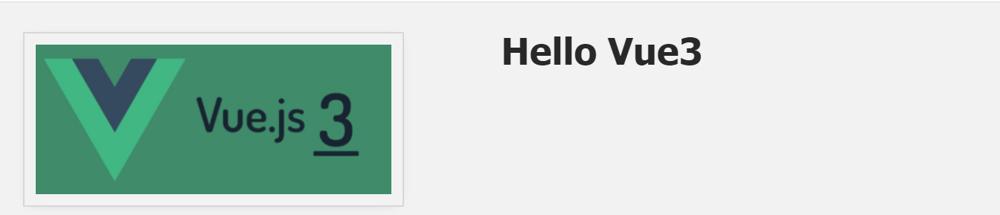
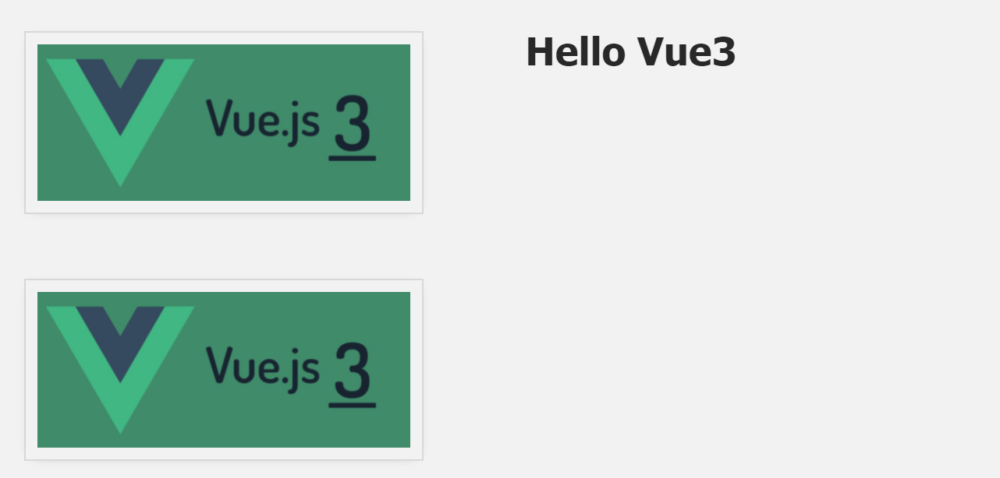

## 2. v-bind指令

在本课中，我们将介绍v-bind的用法。

------

### 2.1 目标

在起始代码中，我们增加一个新的`div`，用来包含图片和文字部分，使用`container`的样式显示，接着在这个`div`中新建一个图片的`div`和文字的`div`，分别使用`image`和`info`式样。我们上一节学过了通过{{变量}}的方式传递值，所以，在文字的`div`里，我们在`<h1>`标签这个位置依然通过变量传值。接着添加一个图片的链接``

📄**index.html**

```html
<body>
    <div id="app">
        <div class="container">
            <div class="image">
                <!-- 图片放在这-->
                
            </div>
            <div class="info">
                <h1>{{ imginfo }}</h1>
            </div>
        </div>
        
    </div>
    <!-- 导入编写的javascript -->
    <script src="./main.js"></script>
</body>
```

📄**main.js**

```javascript
const app = Vue.createApp({
    data() {
        return {
            imginfo: 'Hello Vue3',
        }
    }
});
const mountedApp = app.mount('#app');
```

打开网页可以看到



------

### 2.2在我们的数据中添加图像

还记得在我们的**assets**目录中，我们有一个**image**文件夹，其中包含Vue的图片，让我们从 Vue 应用上的新数据属性中添加一个`image`的字段，并给它一个路径的地址。

📄**main.js**

```javascript
const app = Vue.createApp({
    data() {
        return {
            imginfo: 'Hello Vue3',
            image: './assets/images/vue.png'
        }
    }
});
const mountedApp = app.mount('#app');
```

现在，我们已准备好在模板中添加一个`img`元素。在上面的 **main.js**中，我们`return`了`image`。但是我们写成``，这不会做任何事情。

📄**index.html**

```html
<div class="image">
  
</div>
```

我们希望从数据中提取路径，类似于上一课中使用{{变量}}拉取数据值的方式。

所以这里的问题是：**我们如何将`src`属性绑定到`image`数据？**

------

### 2.3 属性绑定简介

要在 HTML 元素的属性和 Vue 应用数据中的值之间创建绑定，我们将使用名为`v-bind` 的 Vue 指令。

我们在**index.html**中添加

```html

```

📄**index.html**

```html
<body>
    <div id="app">
        <div class="container">
            <div class="image">
                <!-- 图片放在这-->
                <!-- 方法1-->
                
                <!-- 方法2，使用数据绑定-->
                
            </div>
            <div class="info">
                <h1>{{ imginfo }}</h1>
            </div>
        </div>
    </div>
    <!-- 导入编写的javascript -->
    <script src="./main.js"></script>
</body>
```

现在，我们已经在此属性 `image`中的内容与数据本身之间建立了反应式绑定。

在浏览器中查看，我们现在将看到又多显示了一张图片。




------

### 2.4 了解`v-bind`

`v-bind`指令究竟是如何工作的？我们使用此指令将属性动态绑定到表达式。在本例中，属性是`src`，表达式是该属性引号中的任何内容：比如`image`

📄**index.html**

```html
 
```


------

### 2.5 `v-bind`的简写

`v-bind`使用是非常普遍的，我们可以使用它的简写方式：

```html
 
```

可以想象，由于有很多不同的 HTML 属性，我们可以通过此方式，动态的改变它的属性，比如更换式样，是否显示等。`disable`和`enable`一个`button`


