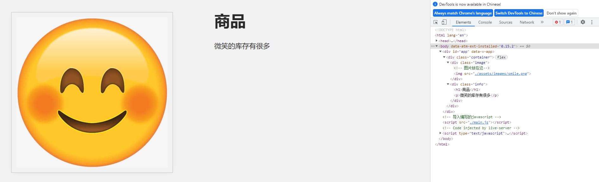
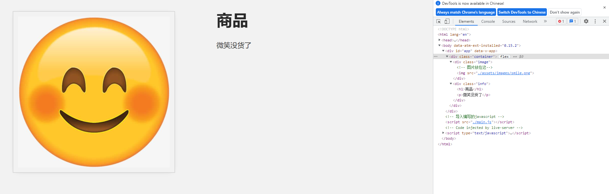
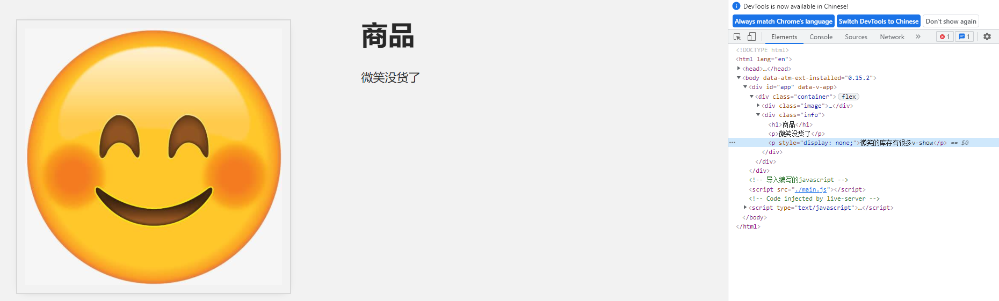

## 3. v-if、v-show指令

在本课中，我们将介绍`v-if`和`v-show`的使用。

------

###  3.1 目标

我们希望根据条件显示不同的 HTML 元素。当我们的产品有货时，我们会显示一个显示"有货"的`p`标签，或者当商品没有库存时，我们会显示一个显示"缺货"的标签。

------

### 3.2 渲染或不渲染

在index.html文件中，我们将添加两个新`p`标签。

📄**index.html**

```html
<p>微笑的库存有很多</p>
<p>微笑没货了</p>
```

然后我们打开网页就可以看到两个`p`标签都被显示出来了，当然这是不符合你的期待的


我们只希望根据我们的产品是否有库存来显示其中一个，因此我们将进入Vue app的数据对象并添加布尔型`inSmile`，用来确认是否显示商品。

📄**main.js**

```javascript
const app = Vue.createApp({
    data() {
        return {
            imginfo: '商品',
            image: './assets/images/smile.png',
            inSmile: true
        }
    }
});
const mountedApp = app.mount('#app');
```

现在，我们已经添加了要有条件地呈现的元素，接下来学习`v-if`指令

------

### 3.3 v-if 指令

我们可以将`v-if指令添加到元素上，以根据条件呈现它，如下所示：`

```html
<p v-if="inSmile">微笑的库存有很多</p>
```

现在，此元素只有在`inSmile`为`true`的情况下才会呈现。

我们可以将`v-if`指令与`v-else`指令组合在一起，就变成了传统的`if-else`条件分支。当`inSmile`为`false`时，就显示`v-else`分支的`p`标签

📄**index.html**

```html
<p v-if="inSmile">微笑的库存有很多</p>
<p v-else>微笑没货了</p>
```

现在我们的代码就变成了这样

```html
<body>
    <div id="app">
        <div class="container">
            <div class="image">
                <!-- 图片放在这-->
                
            </div>
            <div class="info">
                <h1>{{ imginfo }}</h1>
                <p v-if="inSmile">微笑的库存有很多</p>
                <p v-else>微笑没货了</p>
            </div>
        </div>
        
    </div>
    <!-- 导入编写的javascript -->
    <script src="./main.js"></script>
</body>
```

此时因为在**main.js**中我们把`inSmile`设置成了`true`，所以打开网页可以看到`else`分支的`p`标签不见了。通过控制台也能看出，是通过删除的方式去掉了内容为“微笑没货了”这个`p`标签



当我们把**main.js**中我们把`inSmile`设置成了`false`，就变成



------

### 3.4 `v-show`指令

值得注意的是，您并不总是需要`v-if`与` v-else`配对。当然在很多用例中，你只是需要一个标签的显示或者隐藏。在这些情况下，有时使用`v-show`指令是更好的选择。

📄**index.html**

```html
<p v-show="inSmile">微笑的库存有很多</p>
```

完整代码

```html
<body>
    <div id="app">
        <div class="container">
            <div class="image">
                <!-- 图片放在这-->
                
            </div>
            <div class="info">
                <h1>{{ imginfo }}</h1>
                <p v-if="inSmile">微笑的库存有很多</p>
                <p v-else>微笑没货了</p>
                <p v-show="inSmile">微笑的库存有很多v-show</p>
            </div>
        </div>
        
    </div>
    <!-- 导入编写的javascript -->
    <script src="./main.js"></script>
</body>
```

值得注意的是：

`v-show`该指令用于切换元素的**可见性**，是通过设置`style`的方式决定呈现与否

```html
<p style="display: none;">微笑的库存有很多</p>
```

而不是像`v-if`在 DOM 中完全添加和删除元素。也就是说`v-if `把整个的<p>标签在html里面删除了

```html
<p>微笑的库存有很多</p>   
```

所以打开网页，我们在页面上依然看不到新增的内容为"微笑的库存有很多v-show"的`p`标签。

但是打开控制台可以看到，这段代码只是设置成了不显示。



------

### 3.5 实际应用的示例

我们写一下完整的产品库存示例：

- 当库存大于10件时，显示【有货】；
- 当库存小于10件时，显示【快要卖光了】；
- 当库存等于0件时，显示【缺货】

📄**main.js**

```javascript
const app = Vue.createApp({
    data() {
        return {
            ...
            inSmile: 100 
    }
```

我们把`inSmile`改成整型，因此我们可以在表达式中使用更复杂的逻辑。

现在，我们先把之前的示例改一下代码

📄**index.html**

```html
<p v-if="inSmile > 10">有货</p>
<p v-else>缺货</p>
```

接下来需要考虑的是在小于10件大于0件之间的条件通过什么指令加进去，别担心，我们还有一个`v-else-if`指令。

我们把这一条指令加进代码里。

📄**index.html**

```html
<p v-if="inSmile > 10">有货</p>
<p v-else-if="inSmile <= 10 && inSmile > 0">快要卖光了!</p>
<p v-else>缺货</p>
```

完整代码：

```html
<!DOCTYPE html>
<html lang="en">

<head>
    <meta charset="UTF-8" />
    <title>属性绑定</title>
    <!-- 导入式样 -->
    <link rel="stylesheet" href="./assets/styles.css" />
    <!-- 导入 Vue.js -->
    <script src="https://unpkg.com/vue@next"></script>
</head>

<body>
    <div id="app">
        <div class="container">
            <div class="image">
                <!-- 图片放在这-->
                
            </div>
            <div class="info">
                <h1>{{ imginfo }}</h1>
                <p v-if="inSmile > 10">有货</p>
                <p v-else-if="inSmile <= 10 && inSmile > 0">快要卖光了</p>
                <p v-else>缺货</p>
            </div>
        </div>
        
    </div>
    <!-- 导入编写的javascript -->
    <script src="./main.js"></script>
</body>

</html>
```


📄**main.js**

```javascript
const app = Vue.createApp({
    data() {
        return {
            imginfo: '商品',
            image: './assets/images/smile.png',
            inSmile: 100
        }
    }
});
const mountedApp = app.mount('#app');
```


网页展示：


由此可以看出该指令为我们提供了一个中间的逻辑层。也就是下面这个示例中传统的`if else`的嵌套形式。

```javascript
if(条件){
	表达式;
} else if (条件){
	表达式;
} else {
	表达式;
}
```
