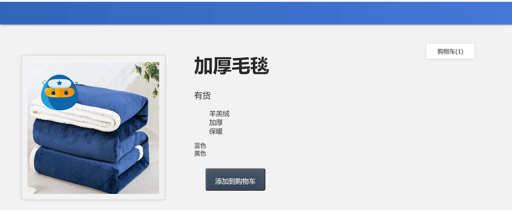
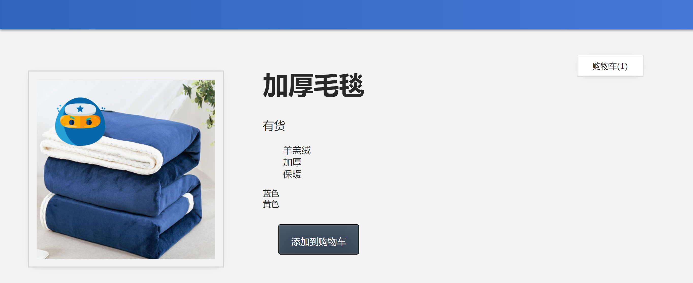
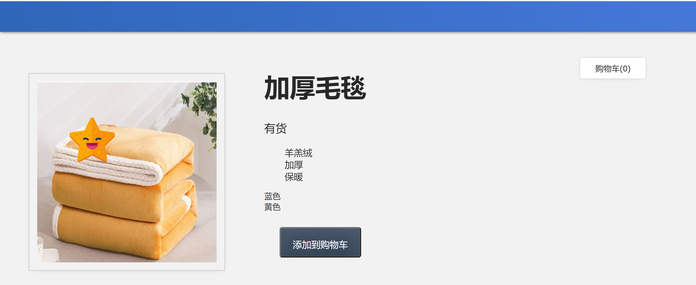
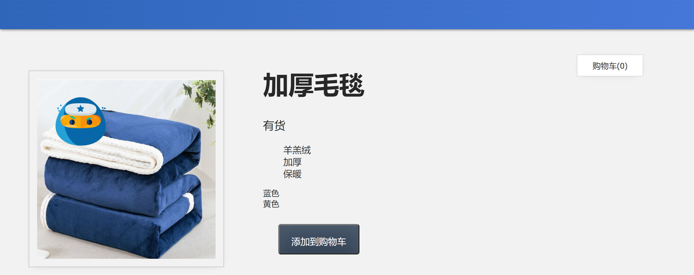

## 5. 事件处理

在本课中，我们将介绍事件处理的概念。

我们在上节课的代码基础上，添加一个使用`cart`式样的`div` ，里面记录有几件商品，所以需要一个{{cart}}的变量，以及增加添到购物车`button` 。

📄**index.html**

```html
<div class="cart">购物车({{ cart }})</div>
...
<button class="button">添加到购物车</button>
```

📄**main.js**

```javascript
data() {
  return {
    cart: 0,
    ...
  }
}
```

------

### 5.1 目标

我们希望能够单击`button` 并递增`cart` 的值。

------

### 5.2 侦听事件

为了知道按钮何时被点击，我们需要侦听该元素上的事件，特别是*单击*事件。我们可以通过使用另一个 Vue 指令来实现此目的：`v-on`

📄**index.html**

```html
<button class="button" v-on:click="logic to run">添加到购物车</button>
```

完整代码：

```html
<body>
    <div id="app">
        <div class="nav-bar"></div>
        <div class="cart">购物车({{ cart }})</div>
        <div class="display">
            <div class="container">
                <div class="image">
                    <!-- 图片放在这-->
                    
                </div>
                <div class="info">
                    <h1>{{ imginfo }}</h1>
                    <p v-if="inSlanket > 10">有货</p>
                    <p v-else-if="inSlanket <= 10 && inSlanket > 0">快要卖光了</p>
                    <p v-else>缺货</p>
                    <ul>
                        <li v-for="detail in details">{{ detail }}</li>
                    </ul>
                    <div v-for="item in items" :key="item.id">{{ item.attrs }}</div>
                    <button class="button" v-on:click="cart += 1">添加到购物车</button>
                </div>
            </div>
        </div>
    </div>
    <!-- 导入编写的javascript -->
    <script src="./main.js"></script>
</body>
```

在这里，我们告诉`v-on`要侦听的事件类型：`click` 。在引号内，我们放置了要在事件发生时运行的逻辑（或方法名称）。

如果我们写入`v-on:click="cart += 1" `，我们将在发生点击事件时将购物车的值递增为1 。

接着添加一个统计购物数量的变量`cart`

📄**main.js**

```javascript
const app = Vue.createApp({
    data() {
        return {
            imginfo: '加厚毛毯',
            image: './assets/images/blue.png',
            inSlanket: 100,
            details: ['羊羔绒', '加厚', '保暖'],
            items: [
                    { id: 001, attrs: '蓝色'},
                    { id: 002, attrs: '黄色' }
            ],
            cart:0,
        }
    }
});
const mountedApp = app.mount('#app');
```

打开网页点击添加到购物车




------

### 5.3 触发方法

因为逻辑`cart += 1`非常简单，我们可以让它在`button`元素上。但通常，我们需要触发更复杂的逻辑。在这些情况下，我们可以添加一个方法名称，以便在事件发生时触发。所以现在让我们这样做。

📄**index.html**

```html
<button class="button" v-on:click="addToCart">添加到购物车</button>
```

现在，单击该按钮时，将运行`addToCart`方法。让我们将该方法添加到 Vue 应用的选项对象中，我们可以使用 `methods` 属性给 Vue定义方法，`methods` 的基本语法：

我们先用JavaScript写一个`addToCart`方法

```javascript
function addToCart() {
    cart += 1;
}
```

放到`methods` 中我们的写法比较简单，直接写`addToCart() {}`即可，这里推荐大家学一下ES6的语法。

```javascript
const app = Vue.createApp({
  data() {
    return {
      ...
      cart: 0,
    }
  },
  methods: {
    addToCart() {
      this.cart += 1
    }
  }
})
```

例如我们在 `addToCart` 方法中，访问 `cart` 属性，可以直接通过 `this.ncart` 形式访问，其中 `this` 表示的就是Vue 实例对象。

在浏览器中，我们现在应该能够单击"**添加到购物车"**按钮，并看到购物车的值增加1.



完整代码：

📄**index.html**

```html
<body>
    <div id="app">
        <div class="nav-bar"></div>
        <div class="cart">购物车({{ cart }})</div>
        <div class="display">
            <div class="container">
                <div class="image">
                    <!-- 图片放在这-->
                    
                </div>
                <div class="info">
                    <h1>{{ imginfo }}</h1>
                    <p v-if="inSlanket > 10">有货</p>
                    <p v-else-if="inSlanket <= 10 && inSlanket > 0">快要卖光了</p>
                    <p v-else>缺货</p>
                    <ul>
                        <li v-for="detail in details">{{ detail }}</li>
                    </ul>
                    <div v-for="item in items" :key="item.id">{{ item.attrs }}</div>
                    <button class="button" v-on:click="addToCart">添加到购物车</button>
                </div>
            </div>
        </div>
    </div>
    <!-- 导入编写的javascript -->
    <script src="./main.js"></script>
</body>
```

📄**main.js**

```javascript
const app = Vue.createApp({
    data() {
        return {
            imginfo: '加厚毛毯',
            image: './assets/images/blue.png',
            inSlanket: 100,
            details: ['羊羔绒', '加厚', '保暖'],
            items: [
                    { id: 001, attrs: '蓝色'},
                    { id: 002, attrs: '黄色' }
            ],
            cart:0,
        }
    },
    methods: {
        addToCart() {
        this.cart += 1
        }
    }
});
const mountedApp = app.mount('#app');
```


------

### 5.4 了解 V-ON

通过添加`v-on`监听`click`事件。当发生单击时，该方法会运行，就会调用`addToCart`方法，是我们购物车的值 `cart`加1.

------

### 5.5 v-on 的简写

我们可以使用 `v-on` 指令 (通常缩写为 `@` 符号) 来监听 DOM 事件，并在触发事件时执行一些 JavaScript。用法为 `v-on:click="methodName"` 或使用快捷方式 `@click="methodName"`

📄**index.html**

```html
<button class="button" @click="addToCart">添加到购物车</button>
```

------

### 5.6 鼠标悬停事件

现在我们已经了解了事件处理的基础知识，让我们在 Vue 应用中侦听另一种类型的事件。

目前，我们在产品详细信息下方显示变体颜色"蓝色"和"黄色"：



如果我们将鼠标悬停在"蓝色"和"黄色"上时，分别触发图像更新为蓝色和黄色图像，这样会感觉很酷。让我们在这些颜色名称上添加侦听`mouseover`（"悬停"）事件的功能。

由于我们希望更新将鼠标悬停在变体颜色上时显示的图像，因此我为`items`里添加了一个新的`image`属性。

并且增加了`updateImage`方法。

📄**main.js**

```javascript
const app = Vue.createApp({
    data() {
        return {
            imginfo: '加厚毛毯',
            image: './assets/images/blue.png',
            inSlanket: 100,
            details: ['羊羔绒', '加厚', '保暖'],
            items: [
                    { id: 001, attrs: '蓝色', image: './assets/images/blue.png' },
                    { id: 002, attrs: '黄色', image: './assets/images/yellow.png'}
            ],
            cart:0,
        }
    },
    methods: {
        addToCart() {
            this.cart += 1
        },
        updateImage(itemImage) {
            this.image = itemImage
        },
    }
});
const mountedApp = app.mount('#app');
```

现在，我们分别有了蓝色和黄色毛毯的图像路径。我们已准备好为在颜色显示上添加`mouseover`事件侦听。一但鼠标悬停在蓝色或者黄色上，就使用`updateImage`方法动态切换显示图片。

📄**index.html**

```html
<div v-for="item in items" :key="item.id" @mouseover="updateImage(item.image)">{{ item.attrs }}</div>
```

完整代码

```html
<body>
    <div id="app">
        <div class="nav-bar"></div>
        <div class="cart">购物车({{ cart }})</div>
        <div class="display">
            <div class="container">
                <div class="image">
                    <!-- 图片放在这-->
                    
                </div>
                <div class="info">
                    <h1>{{ imginfo }}</h1>
                    <p v-if="inSlanket > 10">有货</p>
                    <p v-else-if="inSlanket <= 10 && inSlanket > 0">快要卖光了</p>
                    <p v-else>缺货</p>
                    <ul>
                        <li v-for="detail in details">{{ detail }}</li>
                    </ul>
                    <div v-for="item in items" :key="item.id" @mouseover="updateImage(item.image)">{{ item.attrs }}</div>
                    <button class="button" v-on:click="addToCart">添加到购物车</button>
                </div>
            </div>
        </div>
    </div>
    <!-- 导入编写的javascript -->
    <script src="./main.js"></script>
</body>
```

当事件发生时，我们将触发该方法，传入图像路径。现在在浏览器中，当我们将鼠标悬停在"蓝色"上时，我们应该看到蓝色图像。



当我们将鼠标悬停在"黄色"上时，我们应该看到黄色图像。


