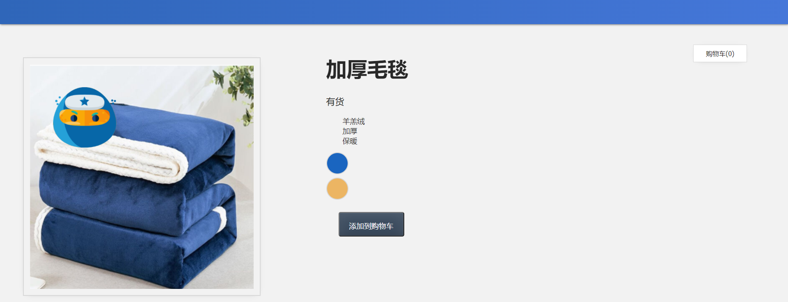
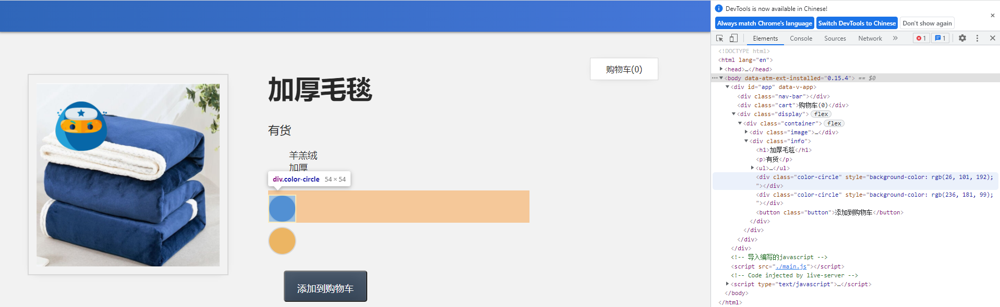
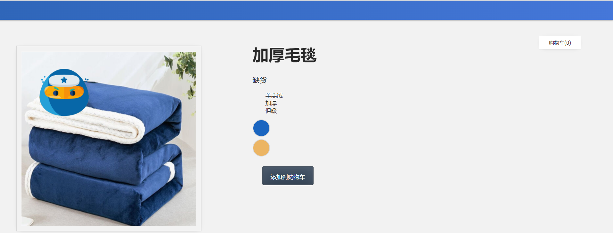
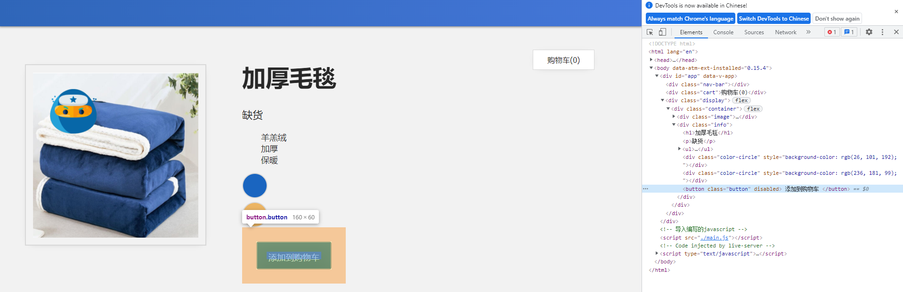
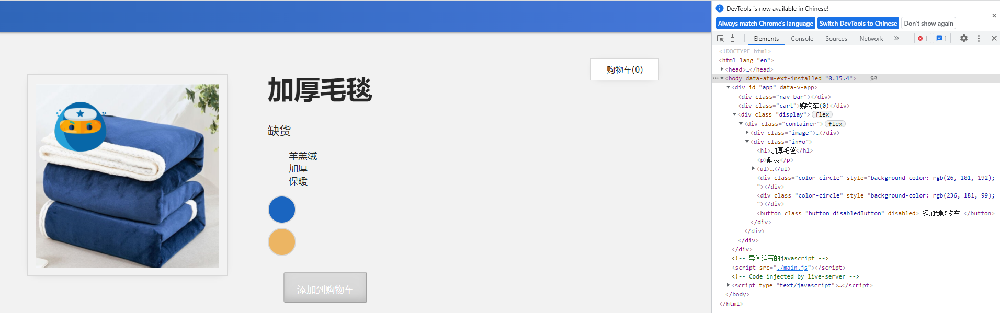
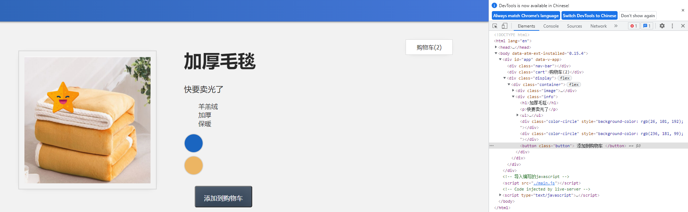

## 6. 类和样式绑定

在本课中，我们将介绍类和样式绑定的概念。

------

### 6.1 目标

根据应用的数据将类和样式绑定到元素。

------

### 6.2 样式绑定

在上一课中，我们添加了一个功能，如果将鼠标悬停在"蓝色"或"黄色"上，则可以更新正在显示的图像;分别是蓝色或黄色的毛毯。但是，如果我们将鼠标悬停在实际的*蓝色*和*黄色*上，而不是将鼠标悬停在“蓝色"或"黄色"的文字上，用户体验不是更好吗？

让我们创建可以悬停在上面的蓝色和黄色圆圈。我们可以通过使用样式绑定来实现这一点。

首先，要像圆圈一样设置 div 的样式，我们需要向变体 div 添加新类。`.color-circle`

📄**index.html**

```html
<div 
  v-for="item in items" 
  :key="item.id" 
  @mouseover="updateImage(item.image)" 
  class="color-circle" 
</div>
```

这个`color-circle`的`class`已经存在于我们的css文件中。我们通过设置`border`的边框式样和使用`border-radius`属性添加圆角，将我们的`div`转换为直径为50px的圆：

📄**styles.css**

```css
.color-circle {
  width: 50px;
  height: 50px;
  margin-top: 8px;
  border: 2px solid #d8d8d8;
  border-radius: 50%;
} 
```

现在我们已经解决了这个问题，我们可以继续进行实际的样式绑定。我们希望将样式绑定到`div`。我们通过在属性上使用`v-bind`（或其简写：`:`）并将样式对象绑定到`style`。因为显示颜色就不需要”蓝色“或”黄色“的字体了，所以也删掉`{{ item.attrs }}`。

📄**index.html**

```html
<div 
    v-for="item in items" 
    :key="item.id" 
    @mouseover="updateImage(item.image)"
    class="color-circle"
    :style="{ backgroundColor: item.attrs }">
</div>
```

在这里，我们将此`div` 的`backgroundColor`设置为等于`item.attrs` 。因此，我们不再是打印出文字"蓝色"和"黄色"了，而是使用它们来设置圆圈的背景色。

我们还需要在`main.js`里更改一下`{{item.attrs}}`的值，这里写”蓝色“或者”黄色“的文字，当css取到值时是识别不了中文的，所以重新取色写上颜色的代码。

📄**main.js**

```javascript
const app = Vue.createApp({
    data() {
        return {
            ...
            items: [
                    { id: 001, attrs: '#1a65c0', image: './assets/images/blue.png' },
                    { id: 002, attrs: '#ecb563', image: './assets/images/yellow.png'}
            ],
            cart:0,
        }
    },
...
});
const mountedApp = app.mount('#app');
```

打开浏览器验证一下，我们现在应该看到两个颜色圆圈用蓝色和黄色背景填充。




------

### 6.3 了解样式绑定

在我们的`div`上，我们添加了`style`属性并给它绑定样式对象。

📄**index.html**

```html
<div 
  ...
  :style="{ backgroundColor: item.attrs }">
</div>
```

我们通过控制台查看渲染后的源码可以看出，Vue 获取`item.attrs`信息并将其转换为代码`background-color: rgb(26, 101, 192)`，然后打印出一个颜色是`#1a65c0`的背景圆圈。



该样式对象具有`backgroundColor`的 CSS 属性 ，我们将该属性设置为等于`item.attrs`。Vue 获取该信息并将其转换为代码，也就是把`<div :style="{ backgroundColor: #1a65c0 }"> `转换成`style="background-color: #1a65c0`，颜色换成rgb模式也就是`rgb(26, 101, 192)`。

然后打印出一个蓝色的背景圆圈。接着通过`v-for`循环此过程创建黄色圆圈。

------

### 6.4 驼峰式与短横线命名

使用这样的样式绑定时，需要考虑一些重要事项。

```html
<div :style="{ backgroundColor: item.attrs }></div>
```

在此表达式中，在JavaScript中`{ backgroundColor: item.attrs }`是一个对象，如果我们使用了`background-color`，那会被解释为一个减号，就变成了两个变量相减的数学表达式。但我们在这里没有做任何数学计算。所以在这里使用驼峰式命名。但是你也可以使用加引号的方式'background-color'来避免数学误解，如下所示：

```html
<div :style="{ 'background-color': item.attrs }></div>
```

我们在6.3中能看到渲染后的代码，Vue会把`backgroundColor`自动转换成`background-color`，所以只要您记住引号，这两个选项都将有效。

------

### 6.5 样式绑定：对象

在6.4中，我们绑定的式样只设置了背景颜色，有时您可能希望添加一堆样式，但将它们全部添加到这里可能会变得混乱。在这些情况下，我们可以把整个样式对象绑定到数据中。

📄**index.html**

```html
<div 
  :style="styles">
</div>
```

📄**main.js**

```javascript
data() {
    return {
        styles: {
            color: 'red',
            fontSize: '14px'
        }
    }
}
```

现在我们已经了解了样式绑定的主题，让我们看一个类似的主题：类绑定。

------

### 6.6 类绑定

回到我们的购物车，发现如果产品缺货，我们仍然可以单击"添加到购物车"按钮并递增购物车的值。但是此时我们不希望用户能够将产品添加到购物车中。因此，让我们更改此行为，使用类绑定在任何时候禁用按钮，并使按钮*显示为*禁用状态。

首先，每当我们的产品缺货时，我们将使用`v-bind`的简写来添加`disabled`属性。

📄**index.html**

```html
<button 
  class="button" 
  :disabled="!inSlanket"
  @click="addToCart">
  Add to Cart
</button>
```

现在，每当我们单击"添加到购物车"按钮时，由于已禁用，因此不会发生任何事情。但该按钮仍然*显示*为活动状态，这对我们的用户具有误导性。


F12查看代码

```HTML
<button class="button" disabled> 添加到购物车 </button>
```




因此，让我们重新设计一下，当产品缺货时，按钮变为灰色，并使它不准许按下，我们改变添加式样，您将在我们的 CSS 文件中看到，我们已经有这个类。

📄**styles.css**

```css
.disabledButton {
  background-color: #d8d8d8;
  cursor: not-allowed;
}
```

因为是在缺货时才应用此类，所以添加数据绑定时别忘了条件`!inSlanket`，也就是`inSlanket`的值为0时。

📄**index.html**

```html
<button 
  class="button" 
  :class="{ disabledButton: !inSlanket }" 
  :disabled="!inSlanket" 
  @click="addToCart">
  Add to Cart
</button>
```

现在，不仅按钮变成了灰色，当你尝试点击时，也是不准许的。

```html
<button class="button disabledButton" disabled> 添加到购物车 </button>
```

可以看到缺货时`disabledButton`这个样式已经被使用了。



当我们在**main.js**中改动一下`inSlanket: 10,`添加到购物车的按钮又回复正常了。所以我们现在可以根据后台的销售数据实时改变按钮的状态。



------

### 6.7 使用多个式样

从6.6中渲染后的代码可以看到，

```html
<button class="button disabledButton" disabled> 添加到购物车 </button>
```

也就是当我们在现有式样的基础上，想通过条件`:class="{ disabledButton: !inSlanket }" `增加另一个式样时，通过F12我们看到网页渲染后这个按钮使用了两个式样类。

所以我们也可以通过三元运算符根据条件添加不同的类`:class="[!inSlanket ? 'disabledButton' : '']"`。

```html
<button 
        class="button" 
        :class="[!inSlanket ? 'disabledButton' : '']"
        :disabled="!inSlanket" 
        @click="addToCart"> 
    添加到购物车 
</button>
```

也达到同样的效果。并且让你多了一份选择。


完整代码：

📄**index.html**

```html
<!DOCTYPE html>
<html lang="en">

<head>
    <meta charset="UTF-8" />
    <title>事件处理</title>
    <!-- 导入式样 -->
    <link rel="stylesheet" href="./assets/styles.css" />
    <!-- 导入 Vue.js -->
    <script src="https://unpkg.com/vue@next"></script>
</head>

<body>
    <div id="app">
        <div class="nav-bar"></div>
        <div class="cart">购物车({{ cart }})</div>
        <div class="display">
            <div class="container">
                <div class="image">
                    <!-- 图片放在这-->
                    
                </div>
                <div class="info">
                    <h1>{{ imginfo }}</h1>
                    <p v-if="inSlanket > 10">有货</p>
                    <p v-else-if="inSlanket <= 10 && inSlanket > 0">快要卖光了</p>
                    <p v-else>缺货</p>
                    <ul>
                        <li v-for="detail in details">{{ detail }}</li>
                    </ul>
                    <div 
                        v-for="item in items" 
                        :key="item.id" 
                        @mouseover="updateImage(item.image)"
                        class="color-circle"
                        :style="{ backgroundColor: item.attrs }">
                    </div>
                    <button 
                        class="button" 
                        :class="{ disabledButton: !inSlanket }" 
                        :disabled="!inSlanket" 
                        @click="addToCart">
                        添加到购物车
                    </button>
                </div>
            </div>
        </div>
    </div>
    <!-- 导入编写的javascript -->
    <script src="./main.js"></script>
</body>

</html>
```

📄**main.js**

```javascript
const app = Vue.createApp({
    data() {
        return {
            imginfo: '加厚毛毯',
            image: './assets/images/blue.png',
            inSlanket: 0,
            details: ['羊羔绒', '加厚', '保暖'],
            items: [
                    { id: 001, attrs: '#1a65c0', image: './assets/images/blue.png' },
                    { id: 002, attrs: '#ecb563', image: './assets/images/yellow.png'}
            ],
            cart:0,
        }
    },
    methods: {
        addToCart() {
            this.cart += 1
        },
        updateImage(itemImage) {
            this.image = itemImage
        },
    }
});
const mountedApp = app.mount('#app');
```

📄**styles.css**

```css
body {
  background-color: #f2f2f2;
  margin: 0px;
  font-family: tahoma;
  color: #282828;
}

.button {
  margin: 30px;
  background-color: #39495c;
  border-radius: 5px;
  font-size: 18px;
  width: 160px;
  height: 60px;
  color: white;
  padding: 20px;
  box-shadow: inset 0 -0.6em 1em -0.35em rgba(0, 0, 0, 0.17),
    inset 0 0.6em 2em -0.3em rgba(255, 255, 255, 0.15),
    inset 0 0 0em 0.05em rgba(255, 255, 255, 0.12);
  text-align: center;
  cursor: pointer;
}

.cart {
  margin: 25px 100px;
  float: right;
  border: 1px solid #d8d8d8;
  padding: 10px 30px;
  background-color: white;
  -webkit-box-shadow: 0px 2px 15px -12px rgba(0, 0, 0, 0.57);
  -moz-box-shadow: 0px 2px 15px -12px rgba(0, 0, 0, 0.57);
  box-shadow: 2px 15px -12px rgba(0, 0, 0, 0.57);
}

.color-circle {
  width: 50px;
  height: 50px;
  margin-top: 8px;
  border: 2px solid #d8d8d8;
  border-radius: 50%;
}

.disabledButton {
  background-color: #d8d8d8;
  cursor: not-allowed;
}

h1 {
  font-size: 50px;
}

h3 {
  font-size: 25px;
}

img {
  border: 2px solid #d8d8d8;
  width: 70%;
  margin: 40px;
  padding: 15px;
  -webkit-box-shadow: 0px 2px 15px -12px rgba(0, 0, 0, 0.57);
  -moz-box-shadow: 0px 2px 15px -12px rgba(0, 0, 0, 0.57);
  box-shadow: 2px 15px -12px rgba(0, 0, 0, 0.57);
}

input {
  width: 100%;
  height: 40px;
  margin-bottom: 20px;
}

label {
  font-size: 20px;
  margin-bottom: 5px;
}

li {
  font-size: 18px;
}

.nav-bar {
  background: linear-gradient(-90deg, #4577d9, #2f66b9);
  height: 60px;
  margin-bottom: 25px;
  -webkit-box-shadow: 0px 2px 15px -12px rgba(0, 0, 0, 0.57);
  -moz-box-shadow: 0px 2px 15px -12px rgba(0, 0, 0, 0.57);
  box-shadow: 1px 1px 5px rgba(0, 0, 0, 0.57);
}

.out-of-stock-img {
  opacity: 0.5;
}

p {
  font-size: 22px;
}

.display {
  display: flex;
  flex-direction: column;
  padding: 1rem;
}

.container {
  display: flex;
  flex-direction: row;
  flex-wrap: wrap;
}

.image,
.info {
  width: 50%;
}

.review-form {
  display: flex;
  flex-direction: column;
  width: 425px;
  padding: 20px;
  margin: 40px;
  border: 2px solid #d8d8d8;
  background-color: white;
  -webkit-box-shadow: 0px 2px 15px -12px rgba(0, 0, 0, 0.57);
  -moz-box-shadow: 0px 2px 15px -12px rgba(0, 0, 0, 0.57);
  box-shadow: 2px 15px -12px rgba(0, 0, 0, 0.57);
}

.review-container {
  width: 425px;
  padding: 20px;
  background-color: white;
  -webkit-box-shadow: 0px 2px 20px -12px rgba(0, 0, 0, 0.57);
  -moz-box-shadow: 0px 2px 20px -12px rgba(0, 0, 0, 0.57);
  box-shadow: 2px 20px -12px rgba(0, 0, 0, 0.57);
  margin-left: 40px;
  border: 2px solid #d8d8d8;
}

.review-container li {
  margin-bottom: 30px;
}

.review-form .button {
  display: block;
  margin: 30px auto;
}

select {
  height: 40px;
  font-size: 20px;
  background-color: white;
  cursor: pointer;
}

textarea {
  width: 95%;
  height: 70px;
  padding: 10px;
  font-size: 20px;
  margin-bottom: 20px;
}

ul {
  list-style-type: none;
}

@media only screen and (max-width: 600px) {
  .container {
    flex-direction: column;
  }

  .image,
  .info {
    margin-left: 10px;
    width: 100%;
  }

  .review-form {
    width: 90%;
  }
}
```

