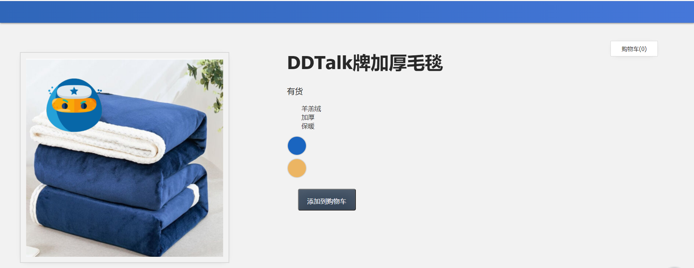
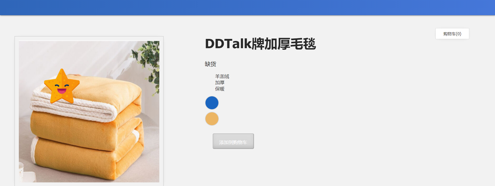

## 7 Computed

在本课中，我们将介绍计算属性的概念。

------

### 7.1 目标

使用计算属性更新产品图片以及是否有库存。

------

### 7.2  简单计算属性

在起始代码中，您会注意到我们有一个新的 data 属性：

📄**main.js**

```javascript
data() {
  return {
    imginfo: '加厚毛毯',
    brand: 'DDTalk',
    ...
}
```

如果我们想在`h1`中合并`imginfo` 和`brand` ，该怎么办？我们可以在这样的表达式中执行此操作：

📄**index.html**

```html
<h1>{{ brand + '牌' + imginfo }}</h1>
```

如果我们在浏览器中检查一下，我们会看到显示"DDTalk牌加厚毛毯"。但是，如果我们的app没有在内部 HTML 的`<h1>`中处理此逻辑，而是能够为我们计算该值，那不是很整洁吗？例如，将`brand` 和 `imginfo`相加，并返回该新值。

Computed与它的意思完全相同：我们可以将其添加到为我们计算值的 Vue app中的属性。它们帮助我们将计算后的值直接应用到HTML上。现在，让我们将此简单示例转换为计算属性。我们将像这样更改 `h1`的表达式：

📄**index.html**

```html
<h1>{{ title }}</h1>
```

现在，现在我们在**main.js**增加`Computed`，然后新建一个`title`用来返回 `brand + '牌' + imginfo`拼接后的值。

📄**main.js**

```javascript
...
computed: {
  title() {
    return this.brand + '牌' + this.imginfo
  }
}
```

这是打开网页，我们仍然会看到显示"DDTalk牌加厚毛毯"，现在我们的网页模板看起来就简洁了。但是，计算属性究竟是如何工作的呢？让我们更深入地了解一下。



------

### 7.3 把它们想象成一个计算器

我喜欢把Computed想象成一个计算器，因为它们为我们计算或计算值。这个计算器取`brand`和`imginfo`的值，并将它们相加，并给出结果。

📄**main.js**

```javascript
const app = Vue.createApp({
    data() {
        return {
            imginfo: '加厚毛毯',
            brand: 'DDTalk',
            ...
        }
    },
    computed: {
        title() {
            return this.brand + '牌' + this.imginfo
        }

    },
 	...
});
const mountedApp = app.mount('#app');
```

正如我之前提到的，Computed为我们提供了性能改进。这是因为它们缓存计算的值，当我们的值发生改变时，计算后的结果也会随之更新。

现在，我们开始理解计算属性，让我们在 Vue  app中实现一个更实际的示例。

------

### 7.4 计算图像和数量

回到我们的代码中，我们在`items`增加一个新的变量`quantity`，用来记录毛毯的数量。

📄**main.js**

```javascript
const app = Vue.createApp({
    data() {
        return {
            ...
            items: [
                    { id: 001, attrs: '#1a65c0', image: './assets/images/blue.png', quantity: 50 },
                    { id: 002, attrs: '#ecb563', image: './assets/images/yellow.png', quantity: 0 }
            ],
            ...
        }
    }
    ...
```

蓝色毛毯有货，黄色毛毯缺货。我们根据目前数据值显示"有货"或"缺货"。因此，我们需要创建一个计算属性，可用于根据这些新数量显示"有货"或"缺货"。

上一节课我们根据鼠标悬停在产品颜色上更新产品图片使用了`updateImage`方法，现在，我们将它改为触发一个名为`updateItem`的新方法，而不是触发触发该方法的鼠标悬停事件。

📄**index.html**

```html
<div 
  v-for="(item, index) in items" 
  :key="item.id" 
  @mouseover="updateItem(index)" <! -- 改成新方法 -->
  class="attrs-circle" 
  :style="{ backgroundattrs: item.attrs }">
</div>
```

这次我们添加了第二个参数：`index`

```html
v-for="(item, index) in items"
```

我们为什么要用`index` ？我们将使用它来告诉我们的app当前鼠标悬停在哪个颜色上，因此它可以使用该信息来触发图片的更新以及该产品是否有库存。

我们将向app添加新的变量`selectedItem`，它将更新为等于`index`

📄**main.js**

```javascript
data() {
  return {
    ...
    selectedItem: 0,
    ...
  }
}
```

我们的`updateItem()`方法会将`selecteditem` 的值设置为等于当前鼠标悬停颜色的`index`值。

📄**main.js**

```javascript
updateitem(index) {
  this.selectedItem = index
}
```

现在，我们已经实现了一种方法，让我们的app知道正在使用哪个产品的数据，并且我们能够使用该信息来触发要显示哪个图片以及是否显示"有货"或"缺货"的计算，具体取决于用户被鼠标悬停在哪个颜色上。

------

现在，我们从数据中删除`image`和`inSlanket`，并将其替换为同名的计算属性。

📄**main.js**

```javascript
computed: {
  image() {
    return ??
  },
  inSlanket() {
    return ??
  }
}
```

那么我们如何获取变体图像和数量呢？这将如下所示：

📄**main.js**

```javascript
image() {
  return this.items[this.selectedItem].image
}
```

我们基于悬停这个颜色的数组索引`index`，来取出它的图片路径`image`和数量`quantity`

```javascript
inSlanket() {
  return this.items[this.selectedItem].quantity
}
```

在浏览器中检查这一点，当我们将鼠标悬停在颜色圆圈上时，我们不仅会更新产品图片，而且还会使用其数量显示该产品是否有货或缺货。


请注意，因为`button`按钮我们没有改变，所以它仍在为我们自动更新启用和禁用。




完整代码：

📄**index.html**

```html
<!DOCTYPE html>
<html lang="en">

<head>
    <meta charset="UTF-8" />
    <title>事件处理</title>
    <!-- 导入式样 -->
    <link rel="stylesheet" href="./assets/styles.css" />
    <!-- 导入 Vue.js -->
    <script src="https://unpkg.com/vue@next"></script>
</head>

<body>
    <div id="app">
        <div class="nav-bar"></div>
        <div class="cart">购物车({{ cart }})</div>
        <div class="display">
            <div class="container">
                <div class="image">
                    <!-- 图片放在这-->
                    
                </div>
                <div class="info">
                    <h1>{{ title }}</h1>
                    <p v-if="inSlanket > 10">有货</p>
                    <p v-else-if="inSlanket <= 10 && inSlanket > 0">快要卖光了</p>
                    <p v-else>缺货</p>
                    <ul>
                        <li v-for="detail in details">{{ detail }}</li>
                    </ul>
                    <div 
                        v-for="(item, index) in items" 
                        :key="item.id" 
                        @mouseover="updateItem(index)"
                        class="color-circle"
                        :style="{ backgroundColor: item.attrs }">
                    </div>
                    <button 
                        class="button" 
                        :class="{ disabledButton: !inSlanket }" 
                        :disabled="!inSlanket" 
                        @click="addToCart">
                        添加到购物车
                    </button>
                </div>
            </div>
        </div>
    </div>
    <!-- 导入编写的javascript -->
    <script src="./main.js"></script>
</body>

</html>
```

📄**main.js**

```javascript
const app = Vue.createApp({
    data() {
        return {
            imginfo: '加厚毛毯',
            brand: 'DDTalk',
            details: ['羊羔绒', '加厚', '保暖'],
            items: [
                    { id: 001, attrs: '#1a65c0', image: './assets/images/blue.png', quantity: 50 },
                    { id: 002, attrs: '#ecb563', image: './assets/images/yellow.png', quantity: 0 }
            ],
            cart: 0,
            selectedItem: 0,
        }
    },
    computed: {
        title() {
            return this.brand + '牌' + this.imginfo
        },
        image() {
            return this.items[this.selectedItem].image
        },
        inSlanket() {
            return this.items[this.selectedItem].quantity
        },
    },
    methods: {
        addToCart() {
            this.cart += 1
        },
        updateItem(index) {
            this.selectedItem = index
        },
    }
});
const mountedApp = app.mount('#app');
```

