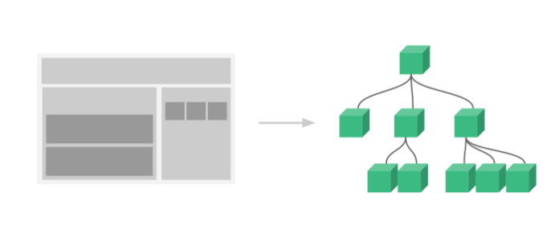
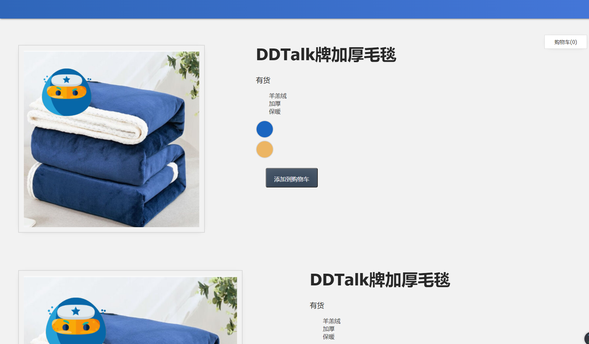
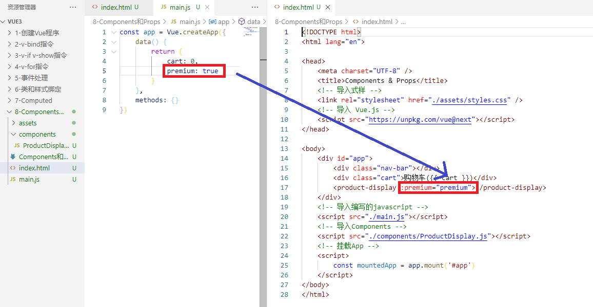
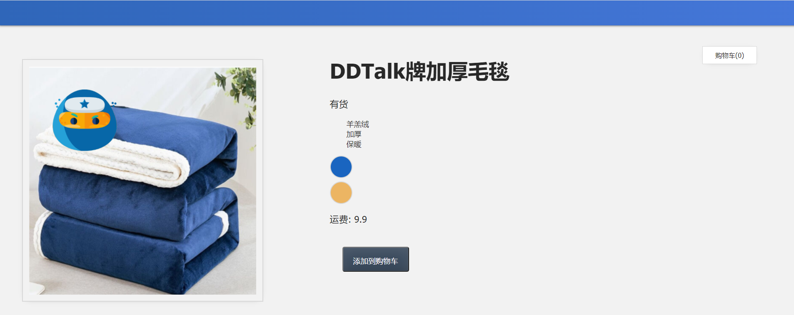

## 8 Components和Props

在本课中，我们将介绍 Vue.js的`Components`和`Props`。

------

### 8.1 目标

重构Vue app以使用`Components`和`Props`。

------

### 8.2 Vue中的组件 (Component) 

组件 (Component) 是 Vue.js 最强大的功能之一。组件可以扩展 HTML 元素，封装可重用的代码。所以你可以想象我们把一个网页拆成多个组件，然后像堆积木一样拼到一起。所以任何给定的网页都可能由多个组件组成。

通常一个应用会以一棵嵌套的组件树的形式来组织：

例如，你可能会有页头、侧边栏、内容区等组件，每个组件又包含了其它的像导航链接、博文之类的组件。




------

#### 8.2.1 创建我们的第一个组件

让我们进入我们的应用程序并创建我们的第一个组件。由于我们的应用最终将具有多个组件，因此我们将创建一个**components**文件夹，我们将在其中创建第一个组件，称为**ProductDisplay.js**。


创建组件的语法如下所示：

📄**components/ProductDisplay.js**

```javascript
app.component('product-display', {})
```

在本例中，第一个参数`'product-display'`是组件名称，第二个参数是用于配置组件的对象（类似于用于配置根 Vue 应用程序的 options 对象）。

------

#### 8.2.2 模板（Template）

由于我们需要组件具有结构，因此我们将添加`template`属性并将前一课的`index.html`中的所有基于产品信息的 HTML 代码都粘贴到此处 

📄**components/ProductDisplay.js**

```javascript
app.component('product-display', {
    template: 
        `<div class="display">
            <div class="container">
                <div class="image">
                    <!-- 图片放在这-->
                    
                </div>
                <div class="info">
                    <h1>{{ title }}</h1>
                    <p v-if="inSlanket > 10">有货</p>
                    <p v-else-if="inSlanket <= 10 && inSlanket > 0">快要卖光了</p>
                    <p v-else>缺货</p>
                    <ul>
                        <li v-for="detail in details">{{ detail }}</li>
                    </ul>
                    <div 
                        v-for="(item, index) in items" 
                        :key="item.id" 
                        @mouseover="updateItem(index)"
                        class="color-circle"
                        :style="{ backgroundColor: item.attrs }">
                    </div>
                    <button 
                        class="button" 
                        :class="{ disabledButton: !inSlanket }" 
                        :disabled="!inSlanket" 
                        @click="addToCart">
                        添加到购物车
                    </button>
                </div>
            </div>
        </div>`
})
```

请注意，我们没有更改任何此代码，我们只是将其移动到`product-display`组件中，以便将其封装在那里。

------

#### 8.2.3 数据和方法

现在我们已经为这个组件提供了它的模板结构，我们需要给它提供它的数据和方法，这些数据和方法仍然存在**main.js**中。因此，我们现在将它们粘贴进去：

📄**components/ProductDisplay.js**

```javascript
app.component('product-display', {
    template: 
        `<div class="display">
           ...
        </div>`,
    data() {
        return {
            imginfo: '加厚毛毯',
            brand: 'DDTalk',
            details: ['羊羔绒', '加厚', '保暖'],
            items: [
                    { id: 001, attrs: '#1a65c0', image: './assets/images/blue.png', quantity: 50 },
                    { id: 002, attrs: '#ecb563', image: './assets/images/yellow.png', quantity: 0 }
            ],
            selectedItem: 0,
        }
    },
    computed: {
        title() {
            return this.brand + '牌' + this.imginfo
        },
        image() {
            return this.items[this.selectedItem].image
        },
        inSlanket() {
            return this.items[this.selectedItem].quantity
        },
    },
    methods: {
        addToCart() {
            this.cart += 1
        },
        updateItem(index) {
            this.selectedItem = index
        },
    }
})
```

我们将把`cart: 0,`从`data`里删除，因为我们不需要每个产品都有自己的购物车。

------

#### 8.2.4 整理main.js

现在，我们已经将所有这些关于产品的代码都封装在`product-display`组件中，我们可以整理一下**main.js**文件。

📄**main.js**

```javascript
const app = Vue.createApp({
    data() {
        return {
            cart: 0,
        }
    },
    methods: {}
});

```

我们保留了`cart` 和`methods`，因为它稍后将有一个新方法。

并把`const mountedApp = app.mount('#app');`转移到**index.html**中，因为我们添加了**components/ProductDisplay.js**

📄**index.html**

```html
<!-- 挂载App -->
<script>
    const mountedApp = app.mount('#app')
</script>
```

------

#### 8.2.5 导入组件

要使用`product-display`组件，我们需要将其导入到我们的**index.html**中。

📄**index.html**

```html
<!-- 导入Components -->
<script src="./components/ProductDisplay.js"></script>
```

现在它已导入，我们可以在模板中使用它。我们在**index.html**中添加`<product-display></product-display>`

📄**index.html**

```html
<body>
    <div id="app">
        <div class="nav-bar"></div>
        <div class="cart">购物车({{ cart }})</div>
        <product-display></product-display>
    </div>
    <!-- 导入编写的javascript -->
    <script src="./main.js"></script>
    <!-- 导入Components -->
    <script src="./components/ProductDisplay.js"></script>
    <!-- 挂载App -->
    <script>
        const mountedApp = app.mount('#app')
    </script>
</body>
```

如果我们在浏览器中检查这一点，我们将看到所有内容仍然像以前一样显示，但是现在由于我们重新安排了内容，"添加到购物车"按钮不再增加购物车。我们将在下一课中修复此问题。

现在，为了向您展示这些可重用的代码块的用处，我们再将再添加一个`product-display`组件。

📄**index.html**

```html
<body>
    <div id="app">
        <div class="nav-bar"></div>
        <div class="cart">购物车({{ cart }})</div>
        <product-display></product-display>
        <product-display></product-display>
    </div>
    ...
</body>
```

当我们刷新浏览器时，我们将看到它们全部显示出来。它们中的每一个都是独立的功能。



------

### 8.3 Props

现在我们开始学习如何将可重用代码封装到这些组件中，当我们的组件需要自身之外的东西时会发生什么？比如我们需要父组件的一些数据，该怎么办？由于组件具有自己的隔离范围，因此它无法到达自身外部以获取其范围之外的内容。

这里我们就需要用到是**Props**。它用于将数据传递到组件中的自定义属性，您可以在其中传递组件所需的数据。

让我们添加`product-display`组件接收Props的能力。

------

#### 8.3.1 为我们的组件提供Props

我们返回到**main.js**中，为Vue app提供一个新的数据属性`premium`。

📄**main.js**

```javascript
const app = Vue.createApp({
  data() {
    return {
      cart: 0,
      premium: true
    }
  }
})
```

如果我们的`product-display`组件需要访问`premium`数据，我们就在`product-display`组件中添加`prop`

📄**components/ProductDisplay.js**

```javascript
app.component('product-display', {
  props: {
    premium: {
      type: Boolean,
      required: true
    }
  },
  ...
}
```

请注意 Vue 的 props 功能如何具有内置验证功能，因此我们可以指定`premium`的`type`以及它是否为被`required`等。所以当你传错`premium`的数据类型时，控制台上就会有提示。

现在我们已经配置了这个，我们可以将该自定义属性添加到`product-display`组件上，你就可以像这样把数据作为一个自定义属性传递进来。

📄**index.html**

```html
<div id="app">
  <div class="nav-bar"></div>
  <div class="cart">Cart({{ cart }})</div>
  <product-display :premium="premium"></product-display>
</div>
```



我们使用`v-bind`可以被动地接收`premium`的新值。如果它更新（从true到false）。

------

#### 8.3.2 使用Props

现在我们的`product-display`组件具有`premium` prop，我们可以在组件中使用它。这时我们就可以有这样的功能：

我们希望判断这个用户是否是注册用户来确定他们是否需要支付运费。

在组件的模板中，我们将添加运费的`<p>`标签

📄**components/ProductDisplay.js**

```html
template: 
  `<div class="product-display">
    ...
      <p>运费: {{ shipping }}</p>
    ...
  </div>`,
```

`shipping`是`product-display`组件上新`computed`的名称，如下所示：

📄**components/ProductDisplay.js**

```javascript
computed: {
  ...
  shipping() {
    if (this.premium) {
      return '免费'
    }
      return 9.9
    }
}
```

`computed`检查`premium` prop 是否为`true` ，如果是，则返回“免费”。否则，它将返回`运费9.9`




完整代码：

📄**index.html**

```html
<!DOCTYPE html>
<html lang="en">

<head>
    <meta charset="UTF-8" />
    <title>Components & Props</title>
    <!-- 导入式样 -->
    <link rel="stylesheet" href="./assets/styles.css" />
    <!-- 导入 Vue.js -->
    <script src="https://unpkg.com/vue@next"></script>
</head>

<body>
    <div id="app">
        <div class="nav-bar"></div>
        <div class="cart">购物车({{ cart }})</div>
        <product-display :premium="premium"></product-display>
    </div>
    <!-- 导入编写的javascript -->
    <script src="./main.js"></script>
    <!-- 导入Components -->
    <script src="./components/ProductDisplay.js"></script>
    <!-- 挂载App -->
    <script>
        const mountedApp = app.mount('#app')
    </script>
</body>
</html>
```

📄**main.js**

```javascript
const app = Vue.createApp({
    data() {
        return {
            cart: 0,
            premium: false
        }
    },
    methods: {}
})
```

📄**components/ProductDisplay.js**

```javascript
app.component('product-display', {
    props: {
        premium: {
        type: Boolean,
        required: true
        }
    },
    template: 
        `<div class="display">
            <div class="container">
                <div class="image">
                    <!-- 图片放在这-->
                    
                </div>
                <div class="info">
                    <h1>{{ title }}</h1>
                    <p v-if="inSlanket > 10">有货</p>
                    <p v-else-if="inSlanket <= 10 && inSlanket > 0">快要卖光了</p>
                    <p v-else>缺货</p>
                    <ul>
                        <li v-for="detail in details">{{ detail }}</li>
                    </ul>
                    <div 
                        v-for="(item, index) in items" 
                        :key="item.id" 
                        @mouseover="updateItem(index)"
                        class="color-circle"
                        :style="{ backgroundColor: item.attrs }">
                    </div>
                    <p>运费: {{ shipping }}</p>
                    <button 
                        class="button" 
                        :class="{ disabledButton: !inSlanket }" 
                        :disabled="!inSlanket" 
                        @click="addToCart">
                        添加到购物车
                    </button>
                </div>
            </div>
        </div>`,
    data() {
        return {
            imginfo: '加厚毛毯',
            brand: 'DDTalk',
            details: ['羊羔绒', '加厚', '保暖'],
            items: [
                    { id: 001, attrs: '#1a65c0', image: './assets/images/blue.png', quantity: 50 },
                    { id: 002, attrs: '#ecb563', image: './assets/images/yellow.png', quantity: 0 }
            ],
            selectedItem: 0,
        }
    },
    computed: {
        title() {
            return this.brand + '牌' + this.imginfo
        },
        image() {
            return this.items[this.selectedItem].image
        },
        inSlanket() {
            return this.items[this.selectedItem].quantity
        },
        shipping() {
            if (this.premium) {
            	return '免费'
            }
            return 9.9
        },
    },
    methods: {
        addToCart() {
            this.cart += 1
        },
        updateItem(index) {
            this.selectedItem = index
        },
    }
})
```

