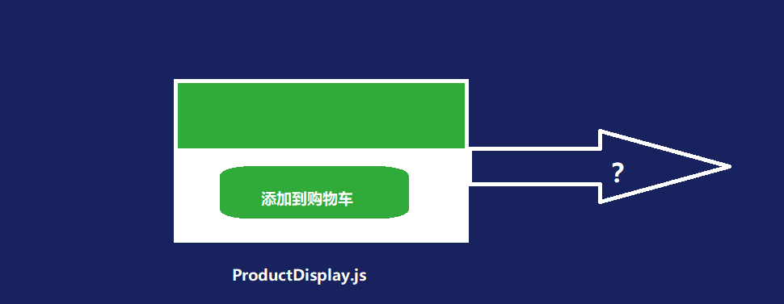
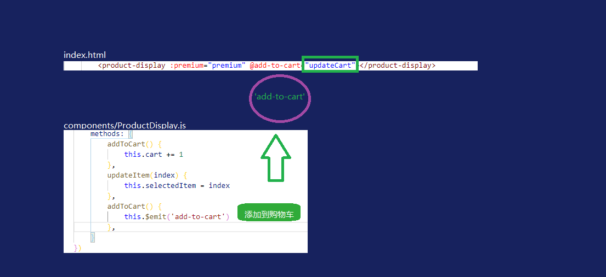
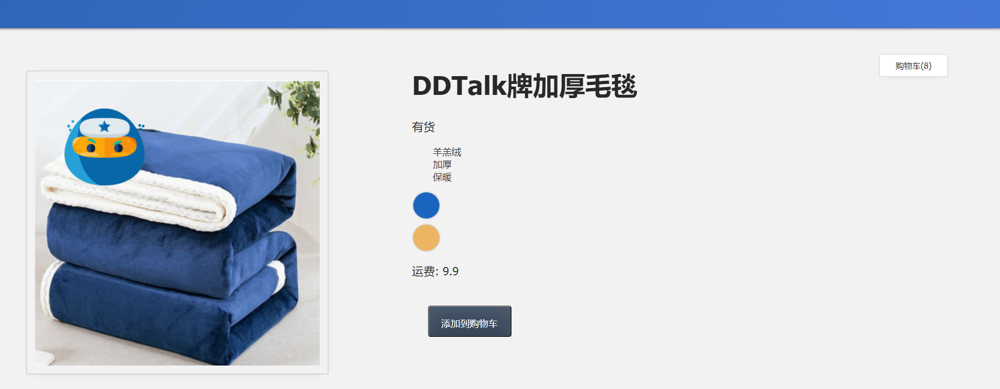
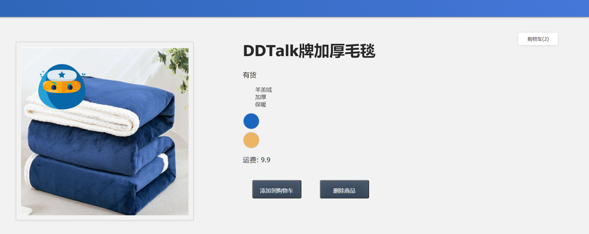
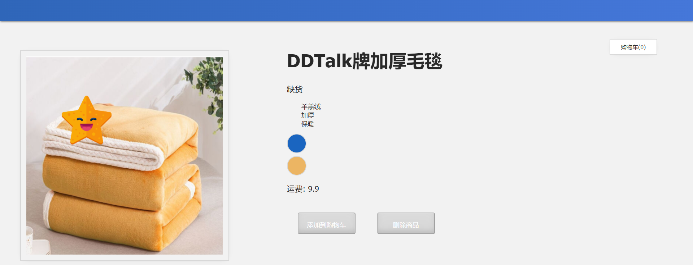

## 9 传达事件

在本课中，我们将介绍在组件中通信事件的概念。

------

### 9.1 目标

使我们的组件能够让其父级组件知道其中发生的事件。

------

### 9.2 发出事件

我们在上一课中重构内容，将与产品相关的代码移动到新组件`product-display`中时，我们中断了单击"添加到购物车"按钮并递增值的能力。这是因为我们在`product-display`组件里删除了`cart`，代替的添加到**main.js**里

我们需要为`product-display`组件提供一种宣布其按钮已单击的方法。我们如何实现这一目标？

我们已经知props是将数据传递到组件中的一种方式，但是当该组件中发生某些事情（例如按钮单击）时呢？我们如何让其他部分知道该事件发生？



答案是发出该事件，告诉父级组件它发生了。让我们通过修改方法在`product-display`组件中添加`addToCart()`功能。

📄**components/ProductDisplay.js**

```javascript
methods: {
	addToCart() {
		this.$emit('add-to-cart')
	}
	...
 }
```

我们将编写`this.$emit()`并发出一个名为`add-to-cart` 的事件。因此，当单击该按钮时，我们会发出或冒泡该事件。就可以通过添加侦听器从父作用域（我们正在使用`product-display`）中侦听该事件：`@add-to-cart`

📄**index.html**

```html
<product-display :premium="premium" @add-to-cart="updateCart"></product-display>
```

当该事件被父级组件"听到"时，它将触发一个名为`updateCart`的新方法，我们将在**main.js**中添加该方法。



📄**main.js**

```javascript
const app = Vue.createApp({
    data() {
        return {
            cart: 0,
            premium: false
        }
    },
    methods: {
        updateCart() {
            this.cart += 1
        }
    }
})
```

我们打开浏览器，能够单击"添加到购物车"按钮，该按钮让父级知道`add-to-cart`事件发生，从而触发`updateCart()`方法。



------

### 9.3 将商品ID添加到购物车

为了使我们的程序更加逼真，我们的购物车不应该只是一个数字。它应该是一个数组，其中包含添加到其中的商品的ID。因此，让我们做一些重构。

📄**main.js**

```javascript
const app = Vue.createApp({
	data() {
		return {
		cart: [],
		...
		}
	},
	methods: {
		updateCart(id) {
			this.cart.push(id)
		}
	}
})
```

现在，`cart`是一个数组，`updateCart(id)`并将商品`id`放入其中。我们只需要在`add-to-cart`事件发射中添加，`updateCart`可以访问此`id`。

📄**components/ProductDisplay.js**

```javascript
methods: {
	addToCart() {
		this.$emit('add-to-cart', this.items[this.selectedItem].id)
      }
    ...
 }
```

在这里，我们添加了第二个参数并抓取了商品的`id`参数，就像我们抓取了之前的`image`和`quantity`一样：

📄**components/ProductDisplay.js**

```javascript
computed: {
	image() {
		return this.items[this.selectedItem].image
	},
	inSlanket() {
		return this.items[this.selectedItem].quantity
	}
}
```

现在在浏览器中，您可以看到我们将商品ID添加到购物车中，该购物车现在是一个数组。


但是我们不需要实际显示这些ID。我们只想显示购物车中有多少商品。还好这非常容易修改。我们只需要取数组的长度即可。

📄**index.html**

```html
<div id="app">
	...
	<div class="cart">购物车({{ cart.length }})</div>
	...
 </div>
```

通过添加`cart.length`，我们现在将仅显示 `cart`。

------

### 9.4 从购物车中删除

我们将添加一个新的删除商品的`button`，把商品从购物车中移除。我们在`ProductDisplay.js`组件中添加新的`button`和新的方法`removeFromCart`，步骤和添加到到购物车`button`过程类似。我们也是通过商品ID来删除它。

📄**components/ProductDisplay.js**

```javascript
app.component('product-display', {
    props: {
        premium: {
        type: Boolean,
        required: true
        }
    },
    template: 
        `<div class="display">
            <div class="container">
                ...
                <div class="info">
                    ...
                    <button 
                        class="button" 
                        :class="{ disabledButton: !inSlanket }" 
                        :disabled="!inSlanket" 
                        @click="addToCart">
                        添加到购物车
                    </button>
                    <button 
                        class="button" 
                        :class="{ disabledButton: !inSlanket }" 
                        :disabled="!inSlanket" 
                        @click="removeFromCart">
                        删除商品
                    </button>
                </div>
            </div>
        </div>`,
    ...
    methods: {
        updateItem(index) {
            this.selectedItem = index
        },
        addToCart() {
            this.$emit('add-to-cart', this.items[this.selectedItem].id)
        },
        removeFromCart() {
            this.$emit('remove-from-cart', this.items[this.selectedItem].id)
        }
    }
})
```

接着在`index.html`的`product-display`组件中添加`remove-from-cart`参数

📄**index.html**

```html
<body>
    <div id="app">
        <div class="nav-bar"></div>
        <div class="cart">购物车({{ cart.length }})</div>
        <product-display 
            :premium="premium" 
            @add-to-cart="updateCart"
            @remove-from-cart="removeById">
        </product-display>
    </div>
    ...
</body>
```

最后在`main.js`中添加`removeById`方法

📄**main.js**

```javascript
const app = Vue.createApp({
    data() {
        return {
            cart: [],
            premium: false
        }
    },
    methods: {
        updateCart(id) {
            this.cart.push(id)
        },
        removeById(id) {
            const index = this.cart.indexOf(id)
            if (index > -1) {
            	this.cart.splice(index, 1)
            }
        }
    }
})
```

网页显示






完整代码：

📄**components/ProductDisplay.js**

```javascript
app.component('product-display', {
    props: {
        premium: {
        type: Boolean,
        required: true
        }
    },
    template: 
        `<div class="display">
            <div class="container">
                <div class="image">
                    <!-- 图片放在这-->
                    
                </div>
                <div class="info">
                    <h1>{{ title }}</h1>
                    <p v-if="inSlanket > 10">有货</p>
                    <p v-else-if="inSlanket <= 10 && inSlanket > 0">快要卖光了</p>
                    <p v-else>缺货</p>
                    <ul>
                        <li v-for="detail in details">{{ detail }}</li>
                    </ul>
                    <div 
                        v-for="(item, index) in items" 
                        :key="item.id" 
                        @mouseover="updateItem(index)"
                        class="color-circle"
                        :style="{ backgroundColor: item.attrs }">
                    </div>
                    <p>运费: {{ shipping }}</p>
                    <button 
                        class="button" 
                        :class="{ disabledButton: !inSlanket }" 
                        :disabled="!inSlanket" 
                        @click="addToCart">
                        添加到购物车
                    </button>
                    <button 
                        class="button" 
                        :class="{ disabledButton: !inSlanket }" 
                        :disabled="!inSlanket" 
                        @click="removeFromCart">
                        删除商品
                    </button>
                </div>
            </div>
        </div>`,
    data() {
        return {
            imginfo: '加厚毛毯',
            brand: 'DDTalk',
            details: ['羊羔绒', '加厚', '保暖'],
            items: [
                    { id: 001, attrs: '#1a65c0', image: './assets/images/blue.png', quantity: 50 },
                    { id: 002, attrs: '#ecb563', image: './assets/images/yellow.png', quantity: 0 }
            ],
            selectedItem: 0,
        }
    },
    computed: {
        title() {
            return this.brand + '牌' + this.imginfo
        },
        image() {
            return this.items[this.selectedItem].image
        },
        inSlanket() {
            return this.items[this.selectedItem].quantity
        },
        shipping() {
            if (this.premium) {
                return '免费'
            }
            return 9.9
        },
    },
    methods: {
        addToCart() {
            this.cart += 1
        },
        updateItem(index) {
            this.selectedItem = index
        },
        addToCart() {
            this.$emit('add-to-cart', this.items[this.selectedItem].id)
        },
        removeFromCart() {
            this.$emit('remove-from-cart', this.items[this.selectedItem].id)
        }
    }
})
```

📄**main.js**

```javascript
const app = Vue.createApp({
    data() {
        return {
            cart: [],
            premium: false
        }
    },
    methods: {
        updateCart(id) {
            this.cart.push(id)
        },
        removeById(id) {
            const index = this.cart.indexOf(id)
            if (index > -1) {
            	this.cart.splice(index, 1)
            }
        }
    }
})
```

📄**index.html**

```html
<!DOCTYPE html>
<html lang="en">

<head>
    <meta charset="UTF-8" />
    <title>传达事件</title>
    <!-- 导入式样 -->
    <link rel="stylesheet" href="./assets/styles.css" />
    <!-- 导入 Vue.js -->
    <script src="https://unpkg.com/vue@next"></script>
</head>

<body>
    <div id="app">
        <div class="nav-bar"></div>
        <div class="cart">购物车({{ cart.length }})</div>
        <product-display 
            :premium="premium" 
            @add-to-cart="updateCart"
            @remove-from-cart="removeById">
        </product-display>
    </div>
    <!-- 导入编写的javascript -->
    <script src="./main.js"></script>
    <!-- 导入Components -->
    <script src="./components/ProductDisplay.js"></script>
    <!-- 挂载App -->
    <script>
        const mountedApp = app.mount('#app')
    </script>
</body>
</html>
```

